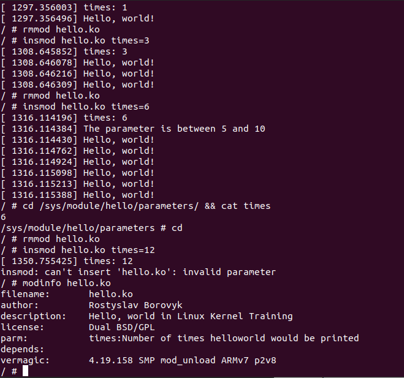

# АК лаб 5

## Program code 
```c
#include <linux/init.h>
#include <linux/module.h>
#include <linux/printk.h>

MODULE_AUTHOR("Rostyslav Borovyk");
MODULE_DESCRIPTION("Hello, world in Linux Kernel Training");
MODULE_LICENSE("Dual BSD/GPL");

static uint times = 1;
module_param(times,uint,S_IRUGO);
MODULE_PARM_DESC(times, "Number of times helloworld would be printed");

static int __init hello(void)
{
  uint i = 0;

  printk(KERN_INFO "times: %d\n", times);

  if(times == 0) {
    pr_warning("The parameter is 0");
  }else if(times >=5 && times <= 10) {
    pr_warning("The parameter is between 5 and 10");
  } else if(times > 10) {
    pr_err(KERN_ERR "The parameter is greater than 10");
    return -EINVAL;
  }

  for(i = 0; i < times; i++){
    pr_info(KERN_INFO "Hello, world!\n");
  }
  return 0;
}


static void __exit hello_exit(void)
{
	/* Do nothing here right now */
}

module_init(hello);
module_exit(hello_exit);
```

## Results

